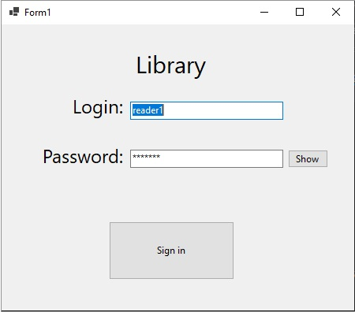
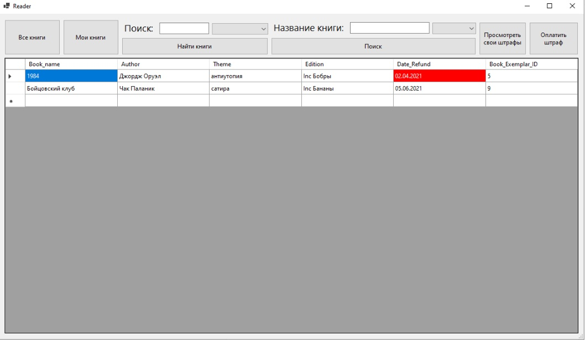
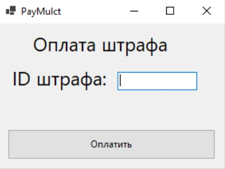
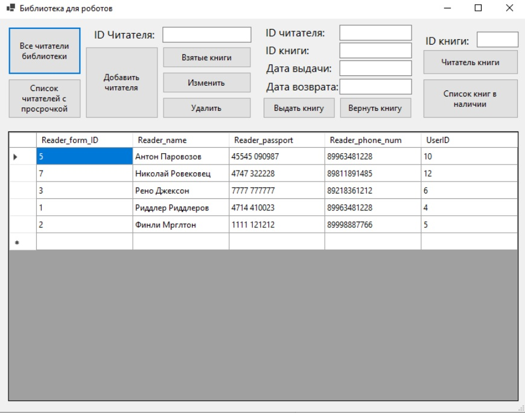
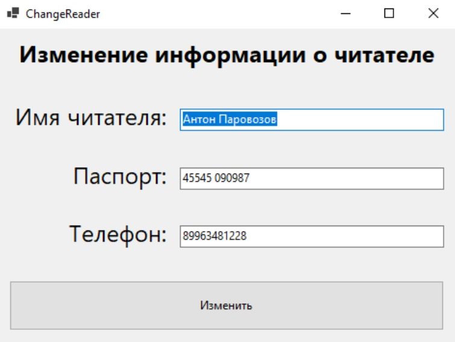
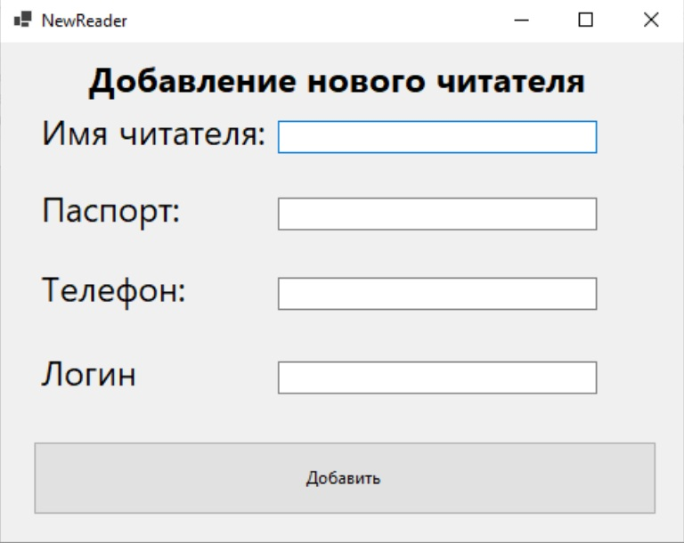
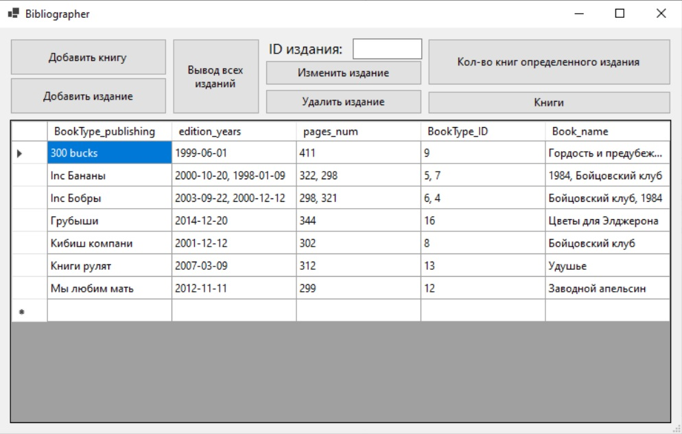
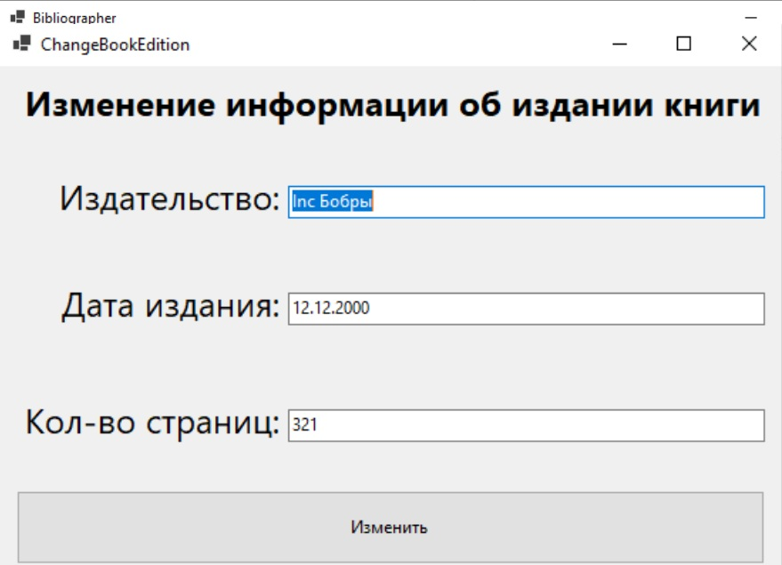
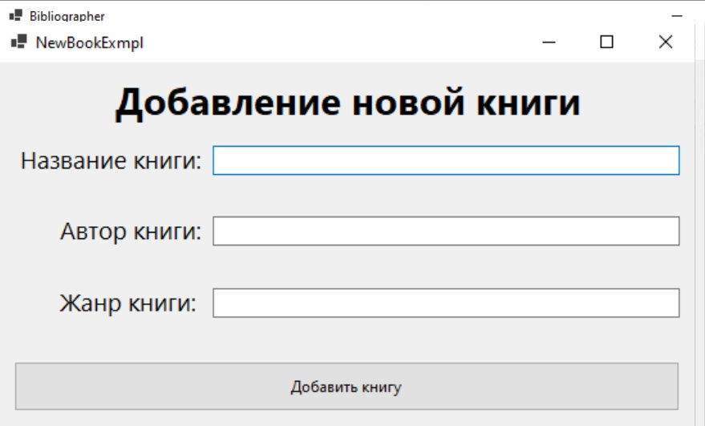
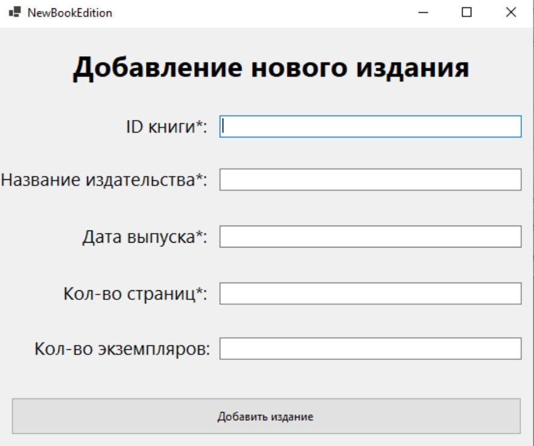

# OldLibrary
OldLibrary — это готовая система для автоматизации работы библиотеки. В системе реализованы три типа пользователей: читатель, библиотекарь и библиограф.

Система хранит полную информацию о всех пользователях, а также об имеющихся в библиотеке книгах, изданиях и экземплярах книг.

Читатель может просматривать каталог книг, отслеживать свои штрафы и оплачивать их.

Библиотекарь оформляет новых пользователей, выдаёт и принимает книги.

Библиограф имеет возможность редактировать данные об изданиях и книгах.

Система полностью готова для использования в библиотечных учреждениях и обеспечивает удобное управление всеми основными процессами.

## Таблица
### Библиотекарь
Сотрудник, отвечающий за учет читателей, выдачу и возврат книг.
| Действие                                         | Входные данные                                                   | Тип операции       |
|--------------------------------------------------|-------------------------------------------------------------------|--------------------|
| Добавить читателя                                | Информация о читателе                                            | Изменение БД       |
| Удалить читателя                                 | ID читателя                                                      | Изменение БД       |
| Найти читателя по экземпляру книги               | ID экземпляра книги                                              | Информация о читателе |
| Показать книги, взятые определённым читателем    | ID читателя                                                      | Информация о экземплярах книг |
| Выдать книгу из библиотеки                       | Номер экземпляра, номер читателя, дата выдачи, дата возврата     | Изменение БД       |
| Забрать книгу обратно                            | ID книги                                                         | Изменение БД       |
| Показать всех читателей                          | –                                                                 | Информация о читателях |
| Показать читателей с просрочкой                  | –                                                                 | Информация о читателях |
| Показать список книг в наличии                   | –                                                                 | Информация о экземплярах книг |
| Изменить информацию о читателе                   | Информация о читателе                                            | Изменение БД       |

### Читатель
Пользователь, который просматривает книги, следит за штрафами и берет издания на руки.
| Действие                                         | Входные данные             | Тип операции           |
|--------------------------------------------------|-----------------------------|------------------------|
| Найти книгу по автору                            | Автор книги                 | Информация о книге     |
| Найти книгу по жанру                             | Жанр книги                  | Информация о книге     |
| Найти книгу по названию                          | Название книги              | Информация о книге     |
| Просмотреть информацию об издании книги          | Название книги              | Информация об изданиях |
| Просмотреть информацию об экземплярах книги      | Название книги              | Информация об экземплярах |
| Вывод всех книг                                  | –                           | Информация о книгах    |
| Посмотреть книги, которые на руках               | –                           | Информация о книгах    |
| Оплатить штраф                                   | ID штрафа                   | Изменение БД           |
| Просмотреть свои штрафы                          | –                           | Информация о штрафах   |

### Библиограф
Специалист, управляющий данными о книгах и их изданиях.
| Действие                                         | Входные данные            | Тип операции            |
|--------------------------------------------------|----------------------------|-------------------------|
| Добавить новую книгу                             | Информация о книге         | Изменение БД            |
| Добавить издание книги                           | Информация об издании      | Изменение БД            |
| Просмотреть все издания                          | –                          | Информация об изданиях  |
| Изменить издание                                 | Информация об издании      | Изменение БД            |
| Удаление издания                                 | ID издания                 | Изменение БД            |
| Вывести экземпляры книг по изданиям              | –                          | Информация об изданиях и экземплярах |

## Схема базы данных

## Клиентское приложение
### Начальное окно
Пароль скрыт, присутствует функция хеширования пароля.
После входа открывается одно из трех возможных меню для каждого типа пользователей (читатель, библиотекарь, библиограф).

### 1. Окно Читателя

- Окно оплаты штрафа

### 2. Окно Библиотекаря  

- Изменение данных о читателе

- Добавление нового читателя

### 3. Окно Библиографа

- Изменение данных об издании книги

- Добавление новой книги

- Добавление нового издания

